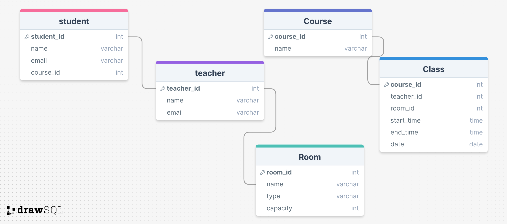

# ProjectSpring
### Functional Requirements:

#### Студент (Student)

- Система повинна дозволяти студентам реєструватися в системі.
- Система повинна надавати студентам можливість перегляду розкладу занять.
- Система повинна дозволяти студентам переглядати інформацію про викладачів та курси.
- Система повинна надавати студентам можливість підписатися на курси.
- Система повинна надавати студентам можливість отримувати сповіщення про зміни у розкладі.

#### Викладач (Teacher)

- Система повинна дозволяти викладачам реєструватися в системі.
- Система повинна надавати викладачам можливість перегляду розкладу занять.
- Система повинна дозволяти викладачам створювати та редагувати курси.
- Система повинна надавати викладачам можливість перегляду списку студентів, підписаних на їх курси.
- Система повинна надавати викладачам можливість встановлення дати, часу та місця проведення занять.

#### Курс (Course)

- Система повинна дозволяти адміністраторам додавати нові курси.
- Система повинна надавати можливість редагування та видалення курсів.
- Система повинна дозволяти прив'язувати курси до викладачів та студентів.

#### Заняття (Class)

- Система повинна дозволяти адміністраторам створювати заняття для курсів.
- Система повинна надавати можливість редагування та видалення занять.
- Система повинна забезпечувати можливість встановлення дати, часу та місця проведення занять.
- Система повинна надавати можливість відстеження відвідуваності студентів.

#### Аудиторія (Room)

- Система повинна дозволяти адміністраторам додавати нові аудиторії.
- Система повинна надавати можливість редагування та видалення аудиторій.
- Система повинна зберігати інформацію про тип аудиторії та її місткість.

#### Додаткові вимоги

- Система повинна надавати інтерфейс для зручного перегляду розкладу занять як для студентів, так і для викладачів.
- Система повинна мати функцію автентифікації та авторизації для захисту даних.
- Система повинна бути здатна надсилати сповіщення студентам та викладачам про зміни у розкладі.
- Система повинна підтримувати можливість імпорту та експорту розкладу занять у форматі CSV.
- Система повинна забезпечувати звітність про відвідуваність та успішність студентів.
# System Behaviours

## Реєстрація користувача (User Registration)

**Вхідні дані:** Ім'я, електронна пошта, пароль.  
**Процес:** Користувач заповнює форму реєстрації. Система перевіряє унікальність електронної пошти та зберігає новий запис у базі даних.  
**Вихідні дані:** Підтвердження реєстрації.

## Аутентифікація користувача (User Authentication)

**Вхідні дані:** Електронна пошта, пароль.  
**Процес:** Користувач вводить свої дані для входу. Система перевіряє відповідність даних у базі.  
**Вихідні дані:** Доступ до системи або повідомлення про помилку.

## Перегляд розкладу (View Schedule)

**Вхідні дані:** Ідентифікатор користувача.  
**Процес:** Користувач переходить на сторінку розкладу. Система завантажує розклад занять відповідно до ролі користувача (студент/викладач).  
**Вихідні дані:** Відображення розкладу.

## Створення курсу (Create Course)

**Вхідні дані:** Назва курсу, опис, викладач.  
**Процес:** Адміністратор або викладач заповнює форму створення курсу. Система зберігає новий курс у базі даних.  
**Вихідні дані:** Підтвердження створення курсу.

## Редагування курсу (Edit Course)

**Вхідні дані:** Ідентифікатор курсу, оновлені дані курсу.  
**Процес:** Адміністратор або викладач оновлює інформацію про курс. Система зберігає зміни у базі даних.  
**Вихідні дані:** Підтвердження редагування курсу.

## Видалення курсу (Delete Course)

**Вхідні дані:** Ідентифікатор курсу.  
**Процес:** Адміністратор або викладач видаляє курс. Система видаляє запис про курс з бази даних.  
**Вихідні дані:** Підтвердження видалення курсу.

## Створення заняття (Create Class)

**Вхідні дані:** Ідентифікатор курсу, викладач, аудиторія, дата, час початку, час завершення.  
**Процес:** Адміністратор або викладач заповнює форму створення заняття. Система зберігає нове заняття у базі даних.  
**Вихідні дані:** Підтвердження створення заняття.

## Редагування заняття (Edit Class)

**Вхідні дані:** Ідентифікатор заняття, оновлені дані заняття.  
**Процес:** Адміністратор або викладач оновлює інформацію про заняття. Система зберігає зміни у базі даних.  
**Вихідні дані:** Підтвердження редагування заняття.

## Видалення заняття (Delete Class)

**Вхідні дані:** Ідентифікатор заняття.  
**Процес:** Адміністратор або викладач видаляє заняття. Система видаляє запис про заняття з бази даних.  
**Вихідні дані:** Підтвердження видалення заняття.

## Сповіщення користувачів (Notify Users)

**Вхідні дані:** Ідентифікатор користувача, тип сповіщення (наприклад, зміна у розкладі).  
**Процес:** Система генерує сповіщення для користувача на основі змін у системі (наприклад, зміна розкладу).  
**Вихідні дані:** Сповіщення користувачів через електронну пошту або інтерфейс системи.

## Перегляд інформації про курс (View Course Information)

**Вхідні дані:** Ідентифікатор курсу.  
**Процес:** Користувач вибирає курс для перегляду. Система завантажує інформацію про курс з бази даних.  
**Вихідні дані:** Відображення інформації про курс.

## Перегляд інформації про викладача (View Teacher Information)

**Вхідні дані:** Ідентифікатор викладача.  
**Процес:** Користувач вибирає викладача для перегляду. Система завантажує інформацію про викладача з бази даних.  
**Вихідні дані:** Відображення інформації про викладача.

# REST API для управління університетським розкладом

## Користувачі (Users)

### Реєстрація користувача (User Registration)

**Метод:** POST  
**URL:** /api/users/register  

**Вхідні дані:**
- `name` (string): Ім'я користувача
- `email` (string): Email користувача
- `password` (string): Пароль користувача

**Вихідні дані:**
- `message` (string): Повідомлення про успішну реєстрацію
- `user_id` (integer): Ідентифікатор користувача

### Аутентифікація користувача (User Authentication)

**Метод:** POST  
**URL:** /api/users/login  

**Вхідні дані:**
- `email` (string): Email користувача
- `password` (string): Пароль користувача

**Вихідні дані:**
- `message` (string): Повідомлення про успішний вхід
- `token` (string): Токен для аутентифікації

### Отримання інформації про користувача (Get User Information)

**Метод:** GET  
**URL:** /api/users/{user_id}  

**Вихідні дані:**
- `user_id` (integer): Ідентифікатор користувача
- `name` (string): Ім'я користувача
- `email` (string): Email користувача
- `courses` (array): Масив ідентифікаторів курсів, на які підписаний користувач

## Курси (Courses)

### Додавання нового курсу (Add New Course)

**Метод:** POST  
**URL:** /api/courses  

**Вхідні дані:**
- `course_name` (string): Назва курсу
- `course_description` (string): Опис курсу

**Вихідні дані:**
- `message` (string): Повідомлення про успішне додавання курсу
- `course_id` (integer): Ідентифікатор нового курсу

### Отримання інформації про курс (Get Course Information)

**Метод:** GET  
**URL:** /api/courses/{course_id}  

**Вихідні дані:**
- `course_id` (integer): Ідентифікатор курсу
- `course_name` (string): Назва курсу
- `course_description` (string): Опис курсу
- `teacher_id` (integer): Ідентифікатор викладача, який веде курс

### Редагування курсу (Edit Course)

**Метод:** PUT  
**URL:** /api/courses/{course_id}  

**Вхідні дані:**
- `course_name` (string): Нова назва курсу
- `course_description` (string): Новий опис курсу

**Вихідні дані:**
- `message` (string): Повідомлення про успішне редагування курсу

### Видалення курсу (Delete Course)

**Метод:** DELETE  
**URL:** /api/courses/{course_id}  

**Вихідні дані:**
- `message` (string): Повідомлення про успішне видалення курсу
## Заняття (Classes)

### Додавання заняття (Add New Class)

**Метод:** POST  
**URL:** /api/classes  

**Вхідні дані:**
- `course_id` (integer): Ідентифікатор курсу
- `teacher_id` (integer): Ідентифікатор викладача
- `room_id` (integer): Ідентифікатор аудиторії
- `start_time` (string): Початковий час заняття
- `end_time` (string): Кінцевий час заняття
- `date` (string): Дата заняття

**Вихідні дані:**
- `message` (string): Повідомлення про успішне додавання заняття
- `class_id` (integer): Ідентифікатор нового заняття

### Отримання інформації про заняття (Get Class Information)

**Метод:** GET  
**URL:** /api/classes/{class_id}  

**Вихідні дані:**
- `class_id` (integer): Ідентифікатор заняття
- `course_id` (integer): Ідентифікатор курсу, до якого відноситься заняття
- `teacher_id` (integer): Ідентифікатор викладача, який веде заняття
- `room_id` (integer): Ідентифікатор аудиторії, де проходить заняття
- `start_time` (string): Початковий час заняття
- `end_time` (string): Кінцевий час заняття
- `date` (string): Дата заняття

### Редагування заняття (Edit Class)

**Метод:** PUT  
**URL:** /api/classes/{class_id}  

**Вхідні дані:**
- `course_id` (integer): Новий ідентифікатор курсу
- `teacher_id` (integer): Новий ідентифікатор викладача
- `room_id` (integer): Новий ідентифікатор аудиторії
- `start_time` (string): Новий початковий час заняття
- `end_time` (string): Новий кінцевий час заняття
- `date` (string): Нова дата заняття

**Вихідні дані:**
- `message` (string): Повідомлення про успішне редагування заняття

### Видалення заняття (Delete Class)

**Метод:** DELETE  
**URL:** /api/classes/{class_id}  

**Вихідні дані:**
- `message` (string): Повідомлення про успішне видалення заняття

## Аудиторії (Rooms)

### Додавання аудиторії (Add New Room)

**Метод:** POST  
**URL:** /api/rooms  

**Вхідні дані:**
- `name` (string): Назва аудиторії
- `type` (string): Тип аудиторії
- `capacity` (integer): Вмістимість аудиторії

**Вихідні дані:**
- `message` (string): Повідомлення про успішне додавання аудиторії
- `room_id` (integer): Ідентифікатор нової аудиторії

### Отримання інформації про аудиторію (Get Room Information)

**Метод:** GET  
**URL:** /api/rooms/{room_id}  

**Вихідні дані:**
- `room_id` (integer): Ідентифікатор аудиторії
- `name` (string): Назва аудиторії
- `type` (string): Тип аудиторії
- `capacity` (integer): Вмістимість аудиторії

### Редагування аудиторії (Edit Room)

**Метод:** PUT  
**URL:** /api/rooms/{room_id}  

**Вхідні дані:**
- `name` (string): Нова назва аудиторії
- `type` (string): Новий тип аудиторії
- `capacity` (integer): Нова вмістимість аудиторії

**Вихідні дані:**
- `message` (string): Повідомлення про успішне редагування аудиторії

### Видалення аудиторії (Delete Room)

**Метод:** DELETE  
**URL:** /api/rooms/{room_id}  

**Вихідні дані:**
- `message` (string): Повідомлення про успішне видалення аудиторії

## ER DIAGRAM

